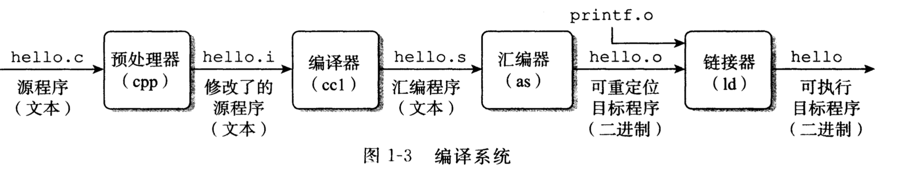
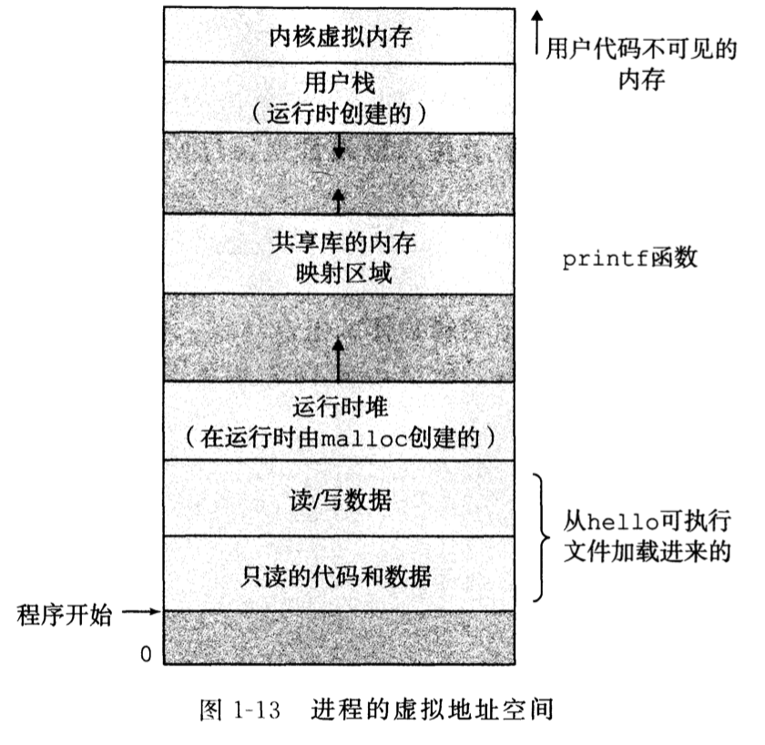
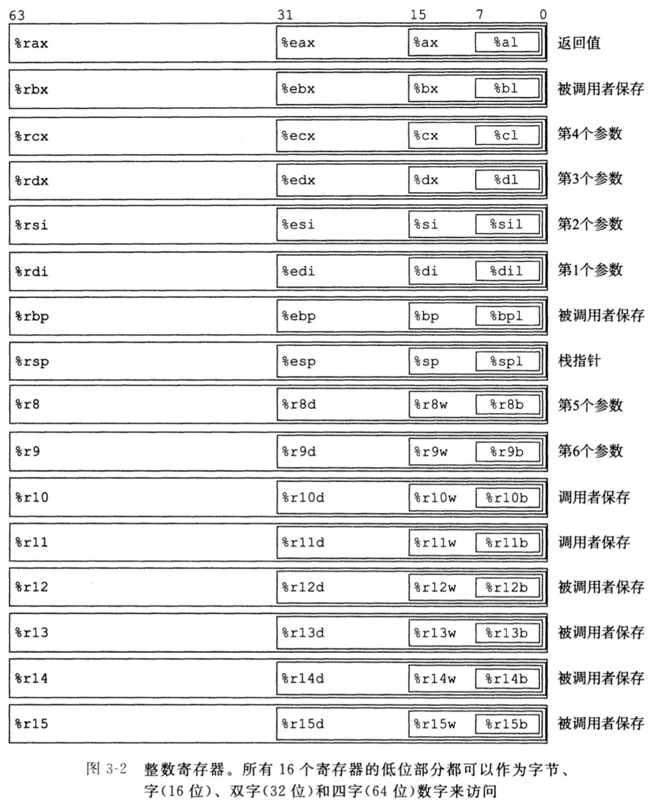
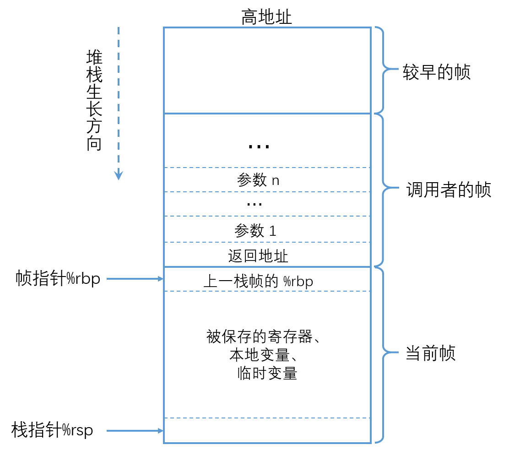

# C与GCC入门

>本文主要参考CSAPP组织

## hello程序

```c
// hello.c
#include <stdio.h>
int main() {
    printf("Hello, World!\n");
    return 0;
}
```

## hello程序声明周期

hello程序的声明周期从一个高级C语言程序`hello.c`开始，为了能够运行这个程序，每条C语句都会被转化为系列低级**机器语言**指令。然后这些指令按照一种称为**可执行目标程序**的格式打包好，并以二进制磁盘文件的形式存放起来。目标程序也可以称为**可执行目标文件**。

在Unix系统中，从源文件到目标文件是通过**编译器**驱动程序完成的：

```shell
linux> gcc -o hello hello.c
```

GCC编译器驱动程序读取源文件`hello.c`，并把它翻译成一个可执行文件`hello.o`。翻译分为四个阶段，如图所示，执行四个阶段的程序（预处理器、编译器、汇编器



- 预处理阶段：预处理器cpp根据`#`开头的语句，修改原始的C程序。例如把`#include`的头文件直接插入到程序中，以及展开宏，生成`hello.i`
- 编译阶段：编译器ccl将文本文件`hello.i`翻译成`hello.s`，`hello.s`中是**汇编语言**程序
- 汇编阶段：汇编器as将hello.s翻译成机器指令，并把这些执行打包保存在`hello.o`的**可重定位目标程序**
- 链接阶段：hello程序中会调用系统函数printf，它存在于一个名为printf.o的预编译好的目标文件中，这个文件将会被合入到hello.o中，链接器ld就是负责这种合并。最终的结果是hello文件，是一个**可执行目标文件**

## 虚拟内存

虚拟内存是一个抽象概念,它为每个进程提供了一个假象,即每个进程都在独占地使用 主存。每个进程看到的内存都是一致的,称为虚拟地址空间。图


- 程序代码和数据：存放可执行目标程序，之后是全局变量
- 堆：malloc和free这样的C标准库函数时,堆可 以在运行时动态地扩展和收缩
- 共享库：存放C标准库和数学库这样的共享库的代码和数据的区域
- 栈：位于用户虚拟地址空间顶部的是用户栈,编译器用它来实现函数调用。和堆一样,用户栈在程序执行期间可以动态地扩展和收缩。特别地,**每次我们调用一个函数时,栈就会增长;从一个函数返回时,栈就会收缩**
- 内核虚拟内存：地址空间顶部的区域是为内核保留的。不允许应用程序读写这个区域的内容或者直接调用内核代码定义的函数。相反,它们必须调用内核来执行这些操作。

## 程序的机器级表示

首先成hello程序的汇编代码

```shell
linux>  gcc -Og -S hello.c
```

会生成hello.s文件，内容如下

```shell
pushq %rbp
movq %rsp, %rbp
leaq L_str(%rip), %rdi
callq _puts
xorl %eax, %eax
popq %rbp
retq
```

寄存器作用



栈帧


## 链接

## 参考文献

<https://zhuanlan.zhihu.com/p/27339191>
