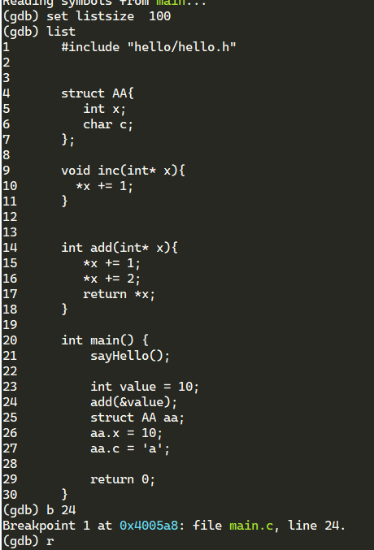
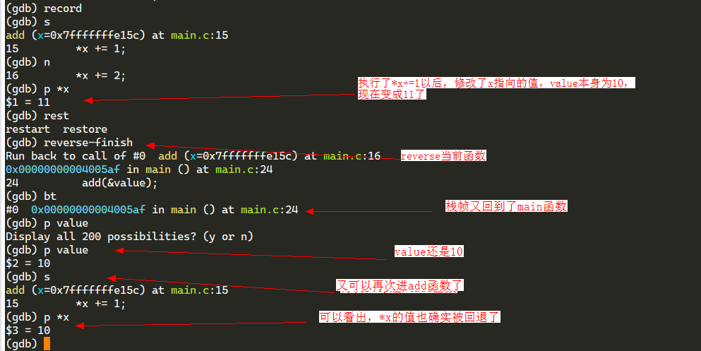

## GDB常用命令

1. 查看代码list
   - list 函数名
   - list 文件名:行号
   - set linesize 100，设置list显示的代码函数
2. 断点
   - 设置断点 b break
      - b 函数名
      - b 文件名:行号
      - b 9 if i==3  条件断点
   - 清除断点 `delete [breakpoints num] [range...]`，断点号由`info breakpoints`得到
      - delete 5
      - delete 1-10
   - 清除断点 cl clear（用法同b)
      - cl 函数名
      - cl 文件名:函数名
      - cl 行号  删除行号的所有断点
      - cl 文件名:行号
3. 运行
   - r  run 启动
   - n  next 运行，不进入函数
   - s  step 运行，进入函数
   - c continue 持续执行，直到遇到断点
4. 打印
   - p print 打印变量
   - disp display 自动打印
   - info 显示信息
      - info locals 打印所有局部变量
      - info breakpoints 打印所有断点信息
      - info registers 打印寄存器的值
5. bt
   - 显示栈帧
6. frame 在栈帧之间调跳转（只是用于查看上下文信息，并不会真的改变当前代码执行的顺序）

## 其他

1. 如何`回退代码执行`，类似 IDE drop栈的功能： 可以通过record和reverse-*命令实现回退一步reverse-step，回退一行reverse-next ，回退当前函数（也就是回退当前栈帧）

   

   

2. 可以使用 TAB 键补全命令
