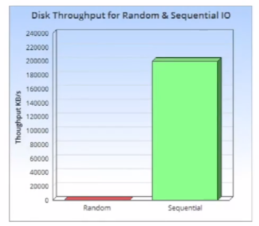
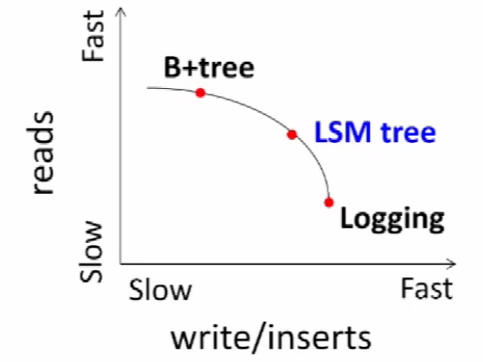
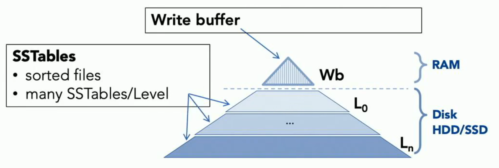
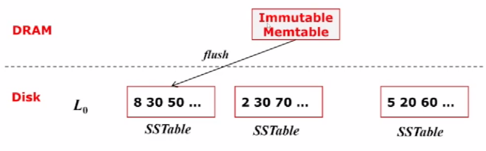
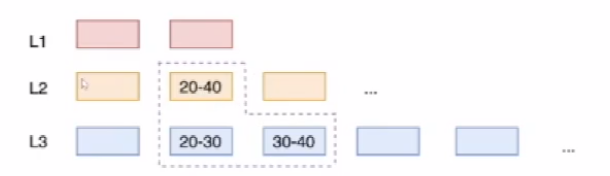
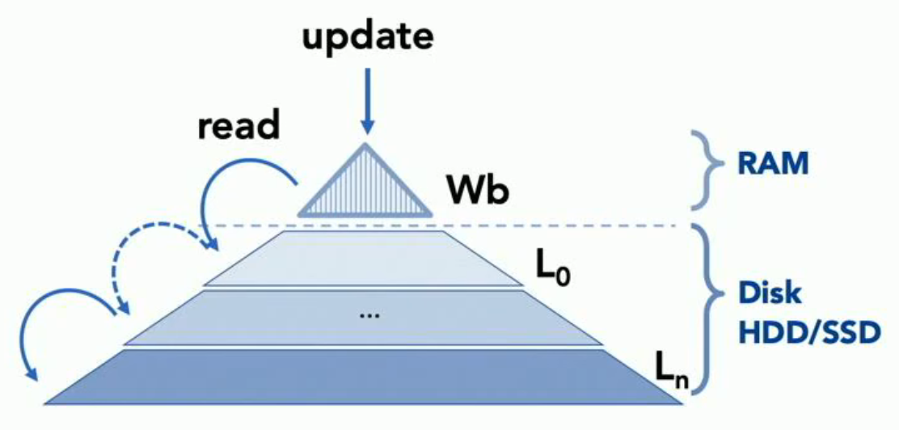
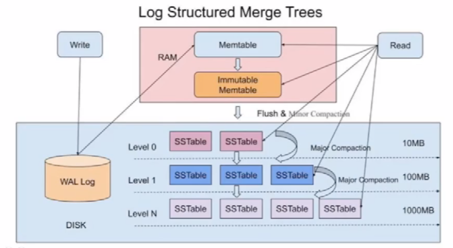
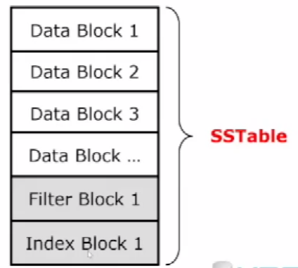
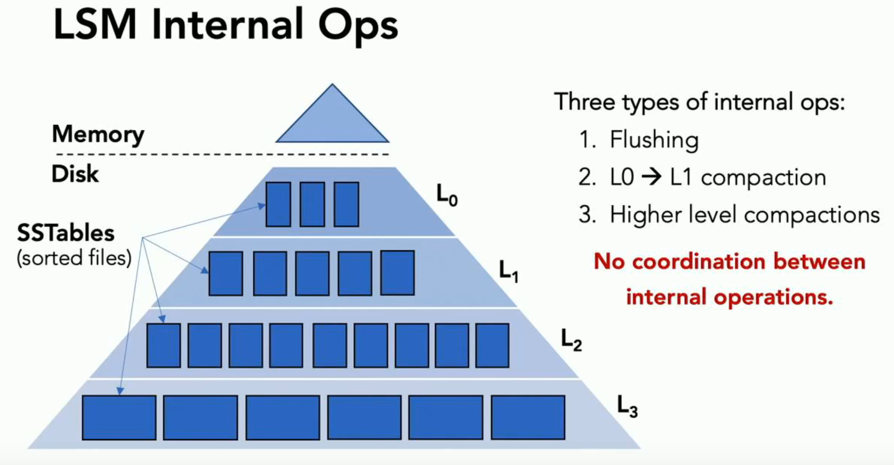

[TOC]

# LSM-tree 介绍

## LSM-tree 设计背景

### B-tree

- 有序、平衡的多级存储结构
- 面向磁盘设计，每个节点都是一个磁盘块
- 查找性能好，适合**读密集**的负载

### B-tree的问题

- 原位更新（In-Place update）
- 写代价高，**写性能差**
  - 对叶节点的写基本都是随机写
  - 级联分裂、合并等 SMO（Structure Modification Operation）操作带来大量的随机写

磁盘顺序读写速度与随机读写速度：

### 如何避免随机写

- 采用 log-sturctured 的 append-only 写
- Log-structured update
  - 类似事务日志的写策略
  - 日志项不允许修改，只能**append**

- 写日志一般可视作是顺序写，写性能高

B-tree、LSM-tree、Logging对比

- B-tree：写慢读块
- Logging：写块读慢
- LSM-tree：先保证写块，同时读也比较快

## LSM-tree

### LSM-tree设计思路

- 同时结合内存结构和磁盘结构（page-based）
- Log-Structured
  - 采用 Append 方式顺序写磁盘数据
- Merge Write
  - 内存批量合并写入磁盘
  - 将多个小的随机写转化为顺序写
- 数据分层写入磁盘
  - 避免一次批量写的数据过大：内存压力过大、批量写时IO太多
- 每一层数据均有序（除了L0）

### LSM-tree 结构

- WAL (Log Disk)：write ahead log，数据写入先写入 WAL，保证不丢失

- Memtable (RAM)：数据写入WAL后，会写入 memtable，然后返回

- Immutable memtable (RAM)：memtable写满后，迁移到 Immutable memtable，Immutable memtable只读，

- L0  (Data Disk, 10MB)：Immutable memtable满了以后会写入L0，包含多个SSTables，每个SSTables内部有序，L0中多个 SSTables 的 key 范围会 overlap（overlap的话就不需要合并操作，可以加快 flush 的速度，否则 flush 慢，如果负载过高，会导致Immutable memtable 还未flush到磁盘，memtable 就满了，阻塞前端写入 ）

  

- L1...Ln (Data Disk, 100MB)：L1-Ln 层的多个 SSTables 互相不重叠且有序，当Li层的文件数/磁盘占用达到一定的阈值后，会选择Li层的一个SSTables与Li+1层与它区间重叠的SSTables做合并（读入RAM，merge，写入到SST），并删除Li层的SSTables

  

### LSM-tree 读写操作

#### LSM-tree 写数据

1. 直接写WAL和Memtable即返回，很快

2. 数据落盘： Flush & Compaction

   

#### LSMTree 读数据

- 先查DRAM结构，依次下沉查磁盘

- 读优化：Skiplist、Block cache、Index Block、Bloom Filter

  

### LSM-tree 内部操作

## LSM-tree 的总结

### 优点

- 把随机写转化为顺序写，支持高吞吐的写（尤其适合分布式大数据场景）
- 采用Append方式写数据，读写数据相对独立，可以支持高并发应用
- 适合写多读少的应用

### 缺点

- 读性能较差
- 空间放大严重，需要Compaction才能回收空间
- **Compaction操作导致系统性能抖动**
  - 系统资源消耗高：1. IO代价（写放大、IO带宽消耗） 2.CPU和内存消耗
  - Block Cache 失效

## 参考文献

1. https://www.bilibili.com/video/BV1A34y1r7fk?from=search&seid=7879178432812616089&spm_id_from=333.337.0.0
2. https://www.bilibili.com/video/BV18A411M7JM/?spm_id_from=333.788.recommend_more_video.2

