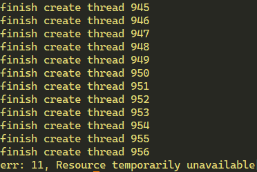
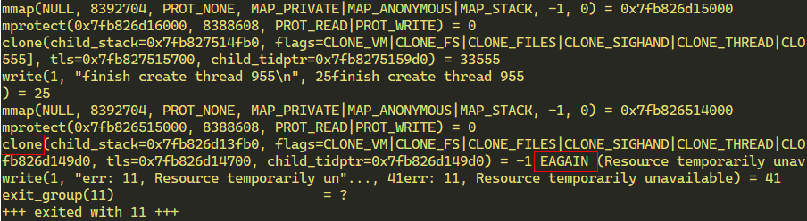
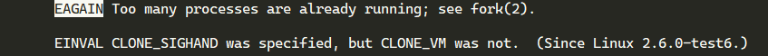
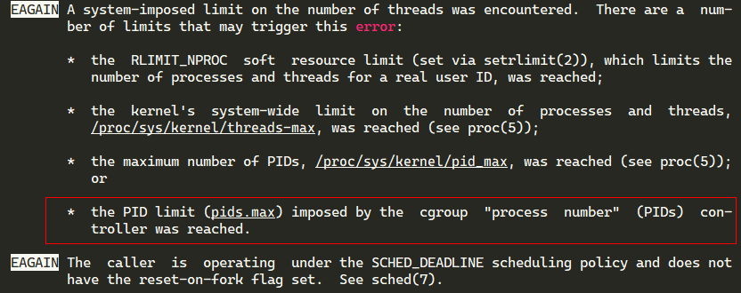
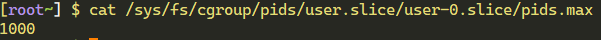
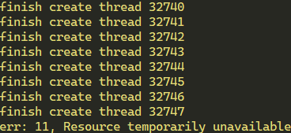

## 使用strace定位pthread_create创建失败问题

1. 构造示例

    ```c++
    #include <iostream>
    #include <pthread.h>
    #include <unistd.h>
    #include <cstring>

    using namespace std;

    pthread_t ntid;

    void printids(const char *s) {
        pid_t pid;
        pthread_t tid;
        sleep(10);

        pid = getpid();
        tid = pthread_self();
        printf("--%s pid %lu tid %lu (0x%1x) \n", s, (unsigned long) pid, (unsigned long) tid, (unsigned long) tid);
    }

    void* thr_fn(void *arg) {
        printids("new thread: ");
        return ((void *) 0);
    }

    int main(int argc, char **argv) {
        int err;
        int i = 0;
        while(1) {
            err = pthread_create(&ntid, NULL, thr_fn, NULL);
            if (err != 0) {
                printf("err: %d, %s", err, strerror(err));
                exit(err);
            }
            i++;
            printf("finish create thread %d\n", i);
        }
    }
    ```

2. 运行程序`./code_snippet`，结果如下

    

3. 使用strace运行程序`strace ./code_snippet`，结果如下

    

4. `man clone`查找这个报错`EAGAIN`

    

5. `man 2 fork`查找这个报错`EAGAIN`

    

6. 逐个排查发现配置`/sys/fs/cgroup/pids/user.slice/user-0.slice/pids.max`为1000

    

7. 修改后问题解决，可以创建超过1000个线程了，但是又在32747处报错，暂且分析到这里，后续再研究

    

ps: `/sys/fs/cgroup/pids/user.slice/user-0.slice/pids.max`如果直接修改文件，只会生效一会，需要用其他办法修改
